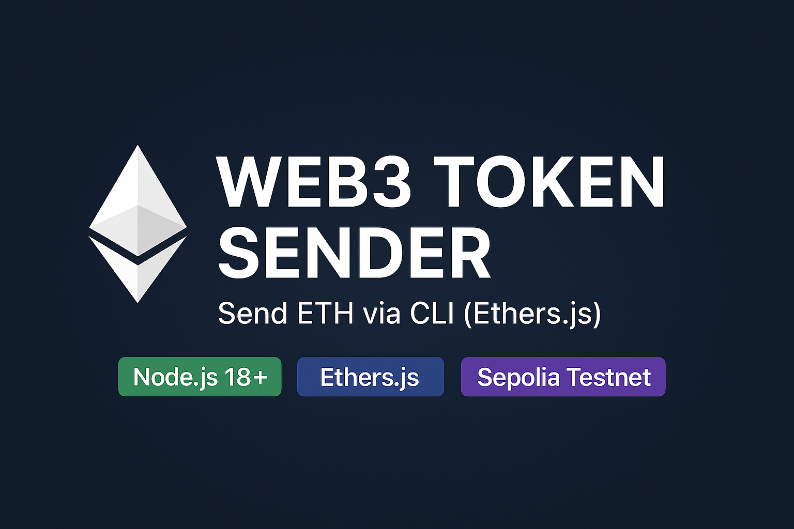

# 🚀 Web3 Token Sender — Send ETH via CLI (Ethers.js)

<p align="center">
  
</p>

CLI-утиліта для відправки нативного ETH у тестовій мережі Sepolia.
Підтримує публічні RPC, приватний ключ від MetaMask і підтвердження транзакцій у реальному часі.

## ✨ Можливості

🔑 Підпис транзакції приватним ключем

🔗 Відправка ETH на будь-яку адресу

⛓ Підтримка Sepolia RPC (PublicNode)

📦 Очікування підтвердження (1 block confirmation)

🧾 Вивід TX hash, статусу та номера блоку

🛑 Обробка помилок (invalid key, insufficient funds, RPC errors)

## 🗂 Структура проєкту

```bash
web3-token-sender/
│── send-native.mjs
│── package.json
│── .env
│── .env.example
│── .gitignore
└── node_modules/

```

## 🔧 Встановлення

```bash
git clone https://github.com/Mrszlv/web3-token-sender.git
cd web3-token-sender
npm install
```

## ⚙️ Налаштування RPC

Створи файл .env:

```ini
RPC_URL=https://ethereum-sepolia-rpc.publicnode.com
```

Або інший RPC:

| Provider   | URL                                             |
| ---------- | ----------------------------------------------- |
| PublicNode | `https://ethereum-sepolia-rpc.publicnode.com`   |
| Alchemy    | `https://eth-sepolia.g.alchemy.com/v2/YOUR_KEY` |
| Infura     | `https://sepolia.infura.io/v3/YOUR_KEY`         |

## 🔑 Як отримати PRIVATE KEY у MetaMask

1. Відкрий MetaMask
2. Клікни по Account → Account details
3. Натисни Export Private Key
4. Введи пароль
5. Скопіюй ключ

## ⚠️ НІКОЛИ не публікуй цей ключ у GitHub!

## ▶️ Запуск скрипта

```bash
node send-native.mjs <PRIVATE_KEY> <TO_ADDRESS> <AMOUNT_ETH>
```

приклад:

```bash
node send-native.mjs 0xYOUR_PRIVATE_KEY 0x1E39C1351E88D186b1BcdC91448bD58F7Fb8a2b5 0.01
```

## 📤 Приклад виконання

```yaml
📤 Відправник: 0x1E39C1351E88D186b1BcdC91448bD58F7Fb8a2b5
📥 Отримувач: 0x1E39C1351E88D186b1BcdC91448bD58F7Fb8a2b5
💰 Сума: 0.01 ETH

🚀 Транзакція відправлена!
🔗 TX hash: 0xad2a6209b537e853...
⏳ Очікування підтвердження...

🟢 Транзакція підтверджена!
📦 Block: 9818014
Status: success
```

## 🔍 Де перевірити транзакцію?

Використовуй Blockscout (найстабільніший для Sepolia):
[SEPOLIA](https://eth-sepolia.blockscout.com/?utm_source=chatgpt.com)

або інші:

| Explorer             | Статус              |
| -------------------- | ------------------- |
| sepolia.etherscan.io | ❌ часто падає      |
| sepolia.basescan.org | ⚠ перевантажений    |
| blockscout.com       | ✅ працює стабільно |

## 📘 Приклад send-native.mjs

```js
import "dotenv/config";
import { ethers } from "ethers";

async function main() {
  try {
    const [, , privateKeyRaw, toAddress, amountRaw] = process.argv;

    if (!privateKeyRaw || !toAddress || !amountRaw) {
      console.error("❌ Використання:");
      console.error("node send-native.mjs <PRIVATE_KEY> <TO_ADDRESS> <AMOUNT>");
      process.exit(1);
    }

    const provider = new ethers.JsonRpcProvider(process.env.RPC_URL);
    const wallet = new ethers.Wallet(privateKeyRaw, provider);

    const amount = ethers.parseEther(amountRaw);

    console.log(`📤 Відправник: ${wallet.address}`);
    console.log(`📥 Отримувач: ${toAddress}`);
    console.log(`💰 Сума: ${amountRaw}`);

    const tx = await wallet.sendTransaction({
      to: toAddress,
      value: amount,
    });

    console.log("\n🚀 Транзакція відправлена!");
    console.log("🔗 TX hash:", tx.hash);
    console.log("⏳ Очікування підтвердження...");

    const receipt = await tx.wait();

    console.log("🟢 Транзакція підтверджена!");
    console.log("🌐 Block:", receipt.blockNumber);
    console.log("Status:", receipt.status);
  } catch (err) {
    console.error("❌ Помилка:", err.message || err);
  }
}

main();
```

## 🔐 Безпека

❗ Не зберігай приватний ключ у .env

❗ Не пуш ключ у GitHub

❗ Не використовуй цей скрипт у mainnet

✔ Безпечно тестувати у Sepolia

## 📄 Ліцензія

[](./LICENSE)

## 👨‍💻 Автор

Miroslav Popovich (@mrszlv)
AI & Web3 Developer

## 🔗 GitHub Repository

[](https://github.com/mrszlv/web3-token-sender)
